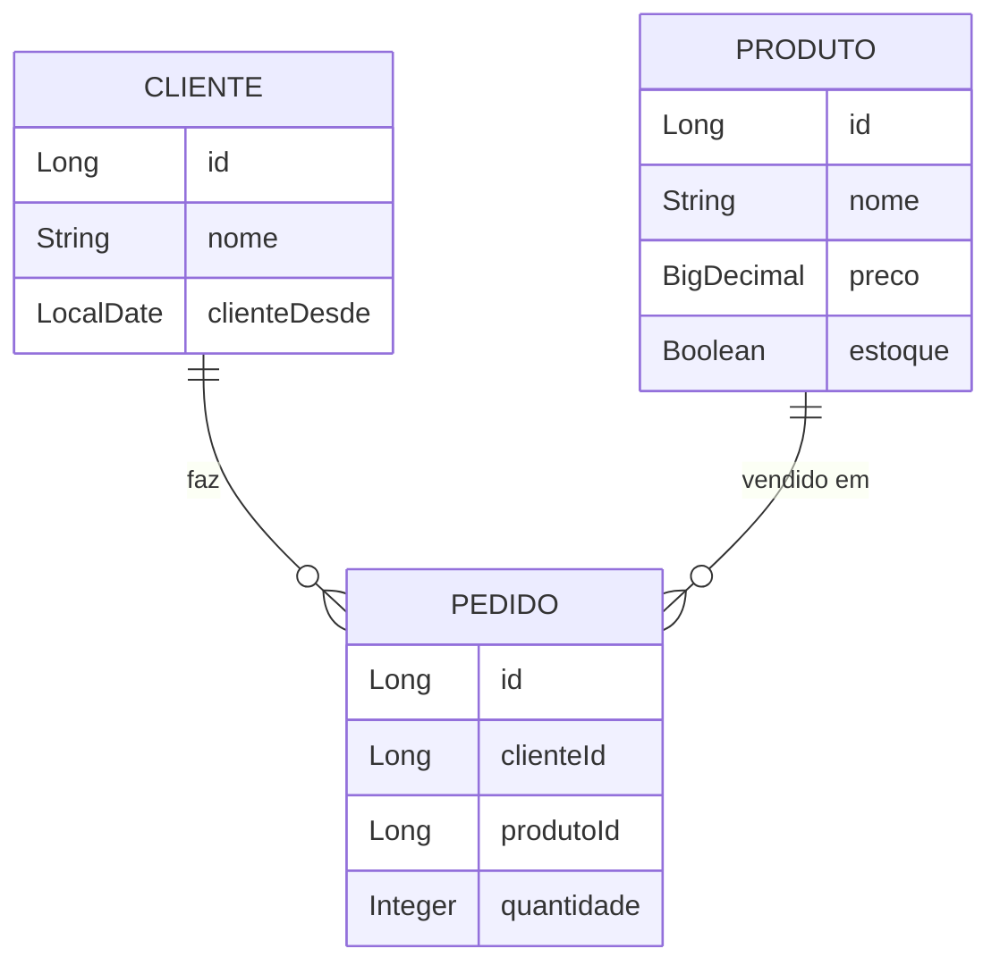

```mermaid
erDiagram
    CLIENTE ||--o{ PEDIDO : faz
    PRODUTO ||--o{ PEDIDO : "vendido em"

    CLIENTE {
        Long id
        String nome
        LocalDate clienteDesde
    }

    PRODUTO {
        Long id
        String nome
        BigDecimal preco
        Boolean estoque
    }

    PEDIDO {
        Long id
        Long clienteId
        Long produtoId
        Integer quantidade
    }
```
